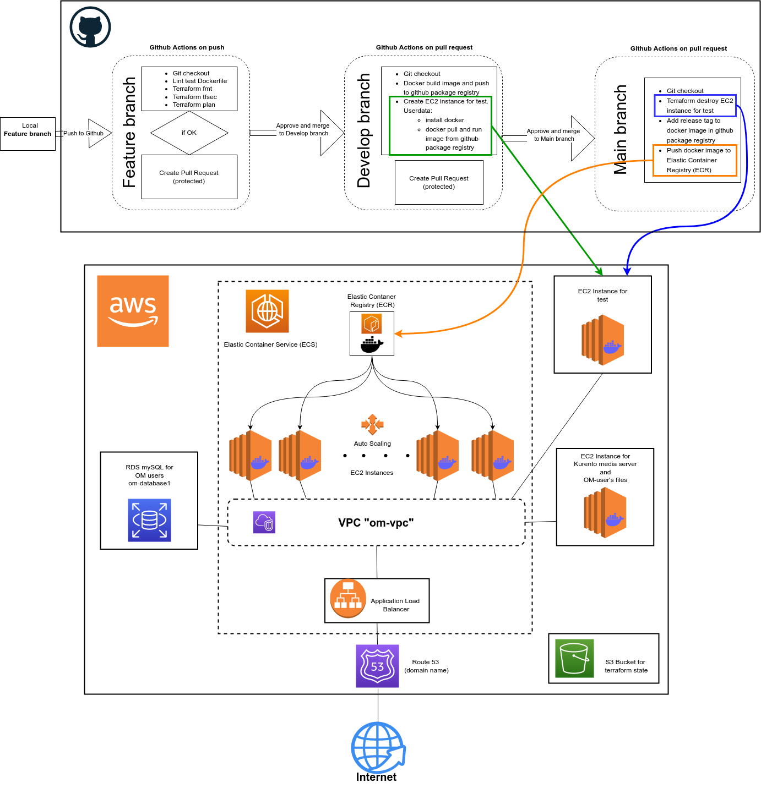

###This project created by Sergey Aleshkevich is a graduation project  while studying DevOps Engineer at TeachMeSkills 
(https://teachmeskills.by/kursy-programmirovaniya/kursy-dev-ops-online).

#####Implemented here:

1. Building infrastructure as code with Terraform on AWS (provisioning VPC, ECS, ALB and EC2 using Terraform)
  
2. Implementation of the CI/CD methodology in the Github Actions environment:
  
As example for deployment selected Openmeetings 7.0.0.

Openmeetings provides video conferencing, instant messaging, white board, collaborative document editing and other groupware tools. 
It uses API functions of Media Server for Remoting and Streaming Kurento. OpenMeetings is a project of The Apache Software Foundation.
Read more about the Openmeetings project here: https://openmeetings.apache.org/

Openmeetings is not originally designed to work in a microservice architecture with autoscaling. The authors suggest deployment on a single server with sufficient resources.

#####Openmeetings consist of components:
 1. currento media server for remoting and streaming;
 2. database (MySql) for save data about users;
 3. disk space (directory) for save userdata (user files, user state, state of white board etc.);
 4. openmeetings web server on apache server.
 
 This project creates one EC2 instance for the Currento media server and disk space for user data. 
 The database (MySQL) is created in AWS RDS.
 
 Openmeetings web server works in AWS Elastic Container Service (ECS), this allows you to scale the service on the number of users and load.
 
 
 To start a project, you must first create an infrastructure.
 The Terraform code and a description for creating the infrastructure are in the repository: https://github.com/serwol2/tf-om-dp
 
 In the next step, all actions are performed in the current repository.
 
 ##### The github repository has 3 branches (see diagram):
   - Feature : if programmers have modified the openmeetings code or need to change the dockerfile, all changes must be made in the feature branch
     This branch does an automated test of the dockerfile and terraform code. 
     If the tests are ok, a secure pull request is automatically generated with an approval request.
     After approved the Feature branch is automatically merged into the Develop branch.
     
   - Develop : github actions start building the docker image and then push it to the github package registry.
     EC2 instance for test is created in the AWS infrastructure and the newly created docker image is installed there.
     A secure pull request is automatically generated along with the approval request.
     We can check how the new docker image works with all the changes made. 
     If the test is ok and after approved the Develop branch is automatically merged into the Main branch.
     
   - Main : github actions start destroy EC2 instance for test. 
     Adds release tag to the newest docker image in the github package registry.
     Push newest docker image to ECR AWS for rolling update in ECS.

     